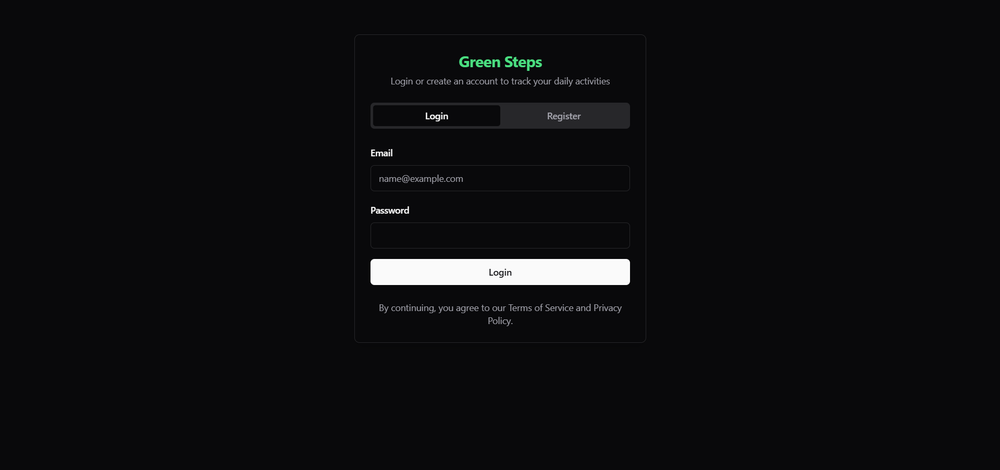
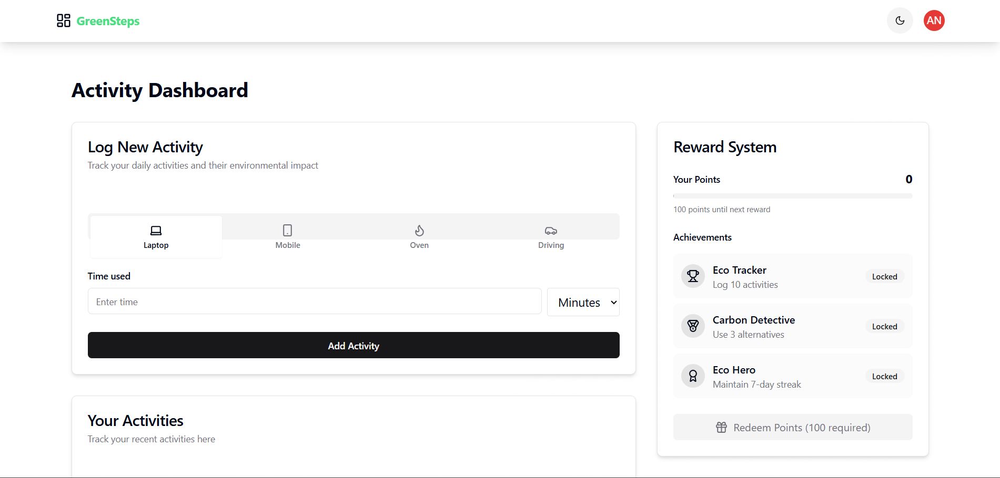
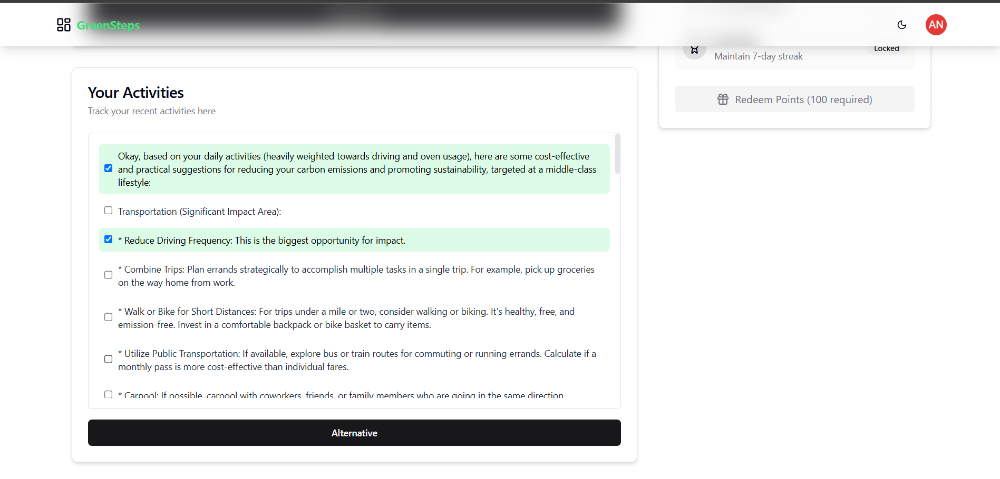
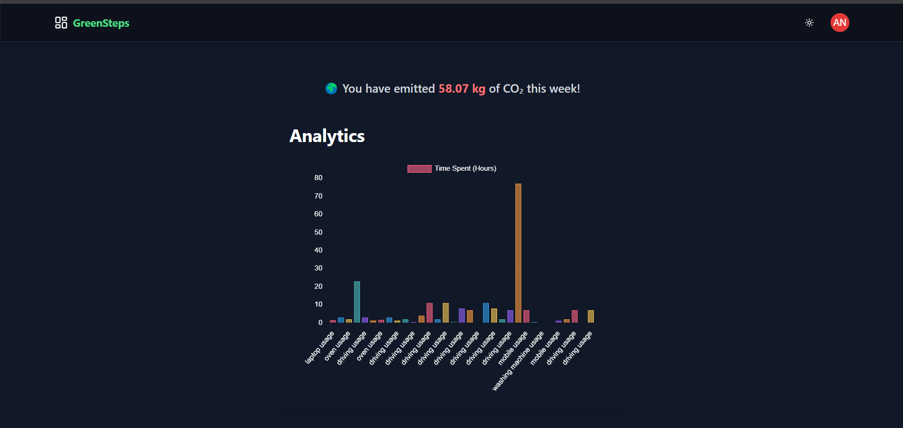
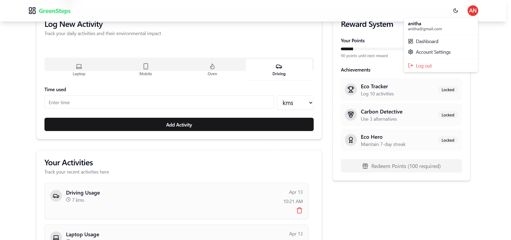

# 🌱 GreenSteps – Track Your Carbon Footprint & Go Greener

GreenSteps is a full-stack web application designed to track your daily carbon-emitting activities and receive smarter, greener alternatives powered by AI. With a sleek glassmorphic UI, insightful analytics, and user-friendly forms, it helps users measure, understand, and reduce their carbon footprint easily.

---

## ✨ Features

- 🌍 **Activity Tracking**: Log everyday actions like travel, energy usage, or food consumption.
- 🤖 **AI-powered Suggestions**: Get eco-friendly alternatives for your logged activities.
- 📊 **Analytics Dashboard**: Visual insights on total emissions, saved carbon, and greener habits.
- 🌙 **Dark/Light Theme Toggle**: Personalize your viewing experience with dynamic theming.
- 👤 **User Authentication**: Secure login/signup with role-based navigation.
- 🧭 **Glassmorphic Navigation**: Stylish and responsive navbar with dropdown menu and avatar support.

---

### 📸 UI Preview

#### 🔐 Authentication Page


#### ➕ Activity Add Form


#### ♻️ AI-Generated Alternatives


#### 📈 Analytics Dashboard


#### 🎁 Reward Screen



## 🧩 Tech Stack

### 🔧 Frontend
- **React.js** with TypeScript
- **Tailwind CSS** for styling
- **React Router DOM** for routing
- **Lucide React** for icons
- **DiceBear Avatars API** for personalized avatars

### 💡 Backend (Pluggable)
- Designed to work with a RESTful backend
- Ideal for Spring Boot / Node.js integration
- Supports AI APIs (like Gemini) for suggestion generation

---

## 🗂️ Components Breakdown

### `ActivityForm.tsx`
- Dynamic form to enter carbon-emitting activity
- Handles type, title, description, and carbon emission data
- Sends form data to backend
- Validates fields and resets after submission

### `ActivityList.tsx`
- Displays user's logged activities
- Calls the AI API to fetch alternative suggestions
- Uses conditional rendering for 0-emission cases
- Shows original activity and suggested alternatives

### `Analytics.tsx`
- Provides summary statistics like:
  - Total carbon emitted
  - Estimated carbon saved
  - Average emission per activity
- Uses cards and graph-style layout for clarity

### `AuthForm.tsx`
- Unified login/register component
- Stores email in local storage on successful login
- Redirects to dashboard post-authentication
- Provides loading and error handling

### `GlassNavigation.tsx`
- Glassmorphic UI navigation bar
- Avatar with initials fetched via DiceBear
- Includes dashboard/account links, theme toggle, and logout
- Fetches user email from localStorage

---

## 🚀 Getting Started

### Prerequisites

- Node.js 16+
- Package Manager (npm / yarn)
- Tailwind & Lucide setup
- Backend endpoint (e.g., Spring Boot API for authentication and carbon tracking)


### Installation

```bash
git clone https://github.com/yourusername/greensteps.git
cd greensteps
npm install
npm run dev
```


### MIT License

<p Style ="text-color:red">Copyright</p> (c) 2025 Prathik R

Permission is hereby granted, free of charge, to any person obtaining a copy
of this software and associated documentation files (the “Software”), to deal
in the Software without restriction, including without limitation the rights
to use, copy, modify, merge, publish, distribute, sublicense, and/or sell
copies of the Software, and to permit persons to whom the Software is
furnished to do so, subject to the following conditions:

The above copyright notice and this permission notice shall be included in
all copies or substantial portions of the Software.

THE SOFTWARE IS PROVIDED “AS IS”, WITHOUT WARRANTY OF ANY KIND, EXPRESS OR
IMPLIED, INCLUDING BUT NOT LIMITED TO THE WARRANTIES OF MERCHANTABILITY,
FITNESS FOR A PARTICULAR PURPOSE AND NONINFRINGEMENT. IN NO EVENT SHALL THE
AUTHORS OR COPYRIGHT HOLDERS BE LIABLE FOR ANY CLAIM, DAMAGES OR OTHER
LIABILITY, WHETHER IN AN ACTION OF CONTRACT, TORT OR OTHERWISE, ARISING FROM,
OUT OF OR IN CONNECTION WITH THE SOFTWARE OR THE USE OR OTHER DEALINGS IN
THE SOFTWARE.


